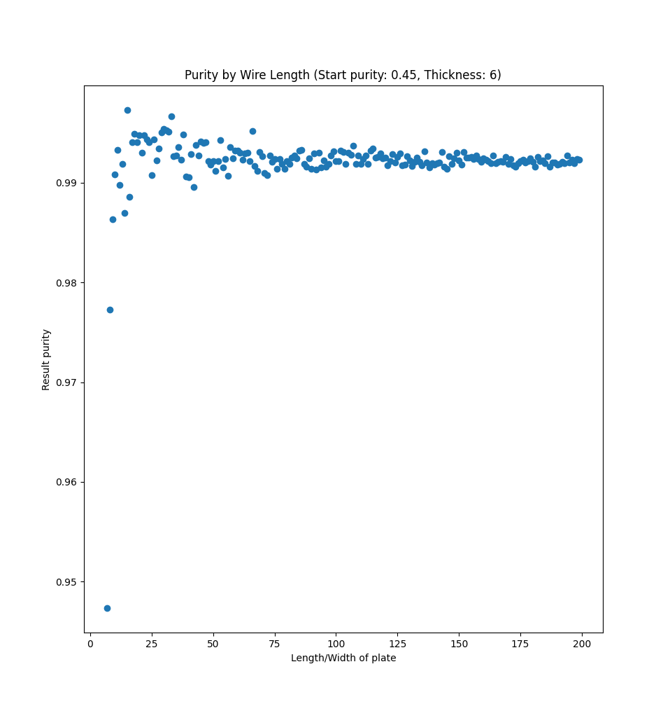

# 458 Final Project: Inquarting

The goal of this project is to simulate the process of inquarting, where high
gold purity is undesirable in the purification process, as it blocks the
dissolvent removing certain impurities like silver.

## Running and Usage

First you will need to install the required dependencies:

```sh
pip install -r requirements.txt
```

Once you have the required dependencies, there are several entrypoints that can
be run, listed below. `visualize3d.py` is a good place to start. These also
serve as example usage.

### `visualize3d.py`


This generates a sample and displays it as voxels. The slider at the bottom
allows you to cut the alloy to see the silver inside. Warning: it is quite slow
to run.

### `sizes_purities.py`


This displays several graphs that show how the size of a sample effects the
resulting purity, as well as the starting purity (as well as how those two
variables interact).

### `perlin_clumpiness.py`


This uses the perlin noise generation algorithm to create alloys with different
frequencies to generate clumps of uniform material with different sizes. By
default, `visualize3d.py` also uses this algorithm.

### `halfmix.py`

Similar to `perlin_clumpiness.py`, this generates an alloy using an algorithm
that is intentionally not uniform. It compares various starting purities under
this condition.

### `remaining_silver_density.py`


This simulation runs several samples, and aggregates them to approximate a
chance of silver appearing in a particular place. Displayed is a slice of the
alloy down the middle. Makes the shape of the dissolution more clear.

### `wire.py`


Generates alloys with a given width/depth but with varying lengths. Graphed is
the length of one of the alloys vs. the purity after nitric acid treating.

### `plate.py`



Similar to `wire.py`, however the thickness is held constant while the
width/height is varied.

